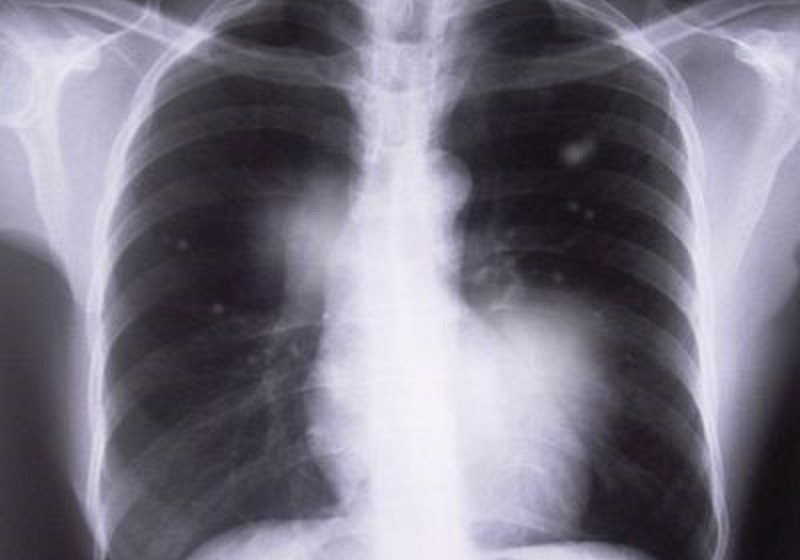

```{r setup, set-options, include=FALSE}

knitr::opts_chunk$set(echo=FALSE,
               cache=TRUE, autodep=TRUE, cache.comments=FALSE,
               message=FALSE, warning=FALSE, tidy = FALSE)
options(width = 400, kableExtra.latex.load_packages = FALSE, knitr.table.format = "latex")

```

```{r includes, include = FALSE}
setwd("~/Documents/R_Projects/GE_Case_Study")

# Load libraries
library(knitr)
library(openxlsx)
library(dplyr)
library(caret)
library(randomForest)
library(ggplot2)
library(reshape2)
library(corrplot)
library(fBasics)
library(rpart)
library(rpart.plot)
library(kableExtra)
```

```{r data_prep, include = FALSE}

# Load data
ru <- read.xlsx("Data/CollatedPneumoconiosisData-GE Internal.xlsx", 1, colNames = TRUE)
rm <- read.xlsx("Data/CollatedPneumoconiosisData-GE Internal.xlsx", 2, colNames = TRUE)
rl <- read.xlsx("Data/CollatedPneumoconiosisData-GE Internal.xlsx", 3, colNames = TRUE)
lu <- read.xlsx("Data/CollatedPneumoconiosisData-GE Internal.xlsx", 4, colNames = TRUE)
lm <- read.xlsx("Data/CollatedPneumoconiosisData-GE Internal.xlsx", 5, colNames = TRUE)
ll <- read.xlsx("Data/CollatedPneumoconiosisData-GE Internal.xlsx", 6, colNames = TRUE)

ru$Position <- "RightUpper"
rm$Position <- "RightMiddle"
rl$Position <- "RightLower"
lu$Position <- "LeftUpper"
lm$Position <- "LeftMiddle"
ll$Position <- "LeftLower"

# Combine all sections into one dataframe
full <- rbind(ru, rm, rl, lu, lm, ll)

# Set levels of the factor - makes it easier to read
full$Label2 <- ifelse(full$Label == 0, 'Normal', 'Abnormal')

# Prepare data set
use_data <- full %>%
        mutate(Label2 = factor(Label2)) %>%
        mutate(Position = factor(Position)) %>% 
        select(-PatientNumMasked, -Label)

```

# Introduction and Problem Statement

Pneumoconiosis, also known as "black lung disease", is an occupational lung disease caused by dusts that are breathed in and then deposited deep in the lungs causing damage [@AmericanLungAssociation2018]. It is often found in employees working in the mining or agricultural industries. There is no cure for Pneumoconiosis, so early detection is vital for proper treatment. 

The traditional method for detecting Pneumoconiosis requires trained doctors to review chest x-rays for abnormalities that may indicate the disease is present. However, due to the lack of trained personnel and the large number of patients waiting to be screened, a reliable and automated process for early detection is desired.

 __Figure 1__ provides an example image of a patient with signs of Pneumoconiosis. An algorithm has been used to segment the lung x-rays and gather data from the images. The images have been reviewed and categorized by trained professionals. The task in this project is to use the data from the images to develop a reliable and automated process that is able to correctly identify those patients having Pneumoconiosis while minimizing the occurences of false positives.

```{r image, out.width = '250px', fig.cap = 'Signs of pneumoconiosis', fig.align = "center", fig.pos = 'H'}



```

\FloatBarrier

# Data

The data consists of 2,606 observations from `r length(unique(full$PatientNumMasked))` patients and is split between six lung segments. The six segments represent the right upper, right middle, right lower, left upper, left middle, and left lower regions of the lung images. The data is provided in an MS Excel spreadsheet, with a separate tab for each segment.

Each segment contains 39 continuous variables and a categorical response variable labeled as '0' for normal, those without the disease, and '1' for abnormal when Pneumoconiosis is present. The 39 continuous features fall into two categories, intensity based and co-occurrence matrix based. To obtain the intensity based features, a set of 6 features based on the histogram of intensity values – mean, standard deviation, skewness, kurtosis, energy and entropy were extracted. 

Apart from calculating these on the original ROI, we also extract these features after applying a difference filter on the image for the purpose of local enhancement. If I(x,y) denotes the image gray value at (x,y), the first and second order filters are defined as:


\FloatBarrier

# Exploratory Data Analysis

Note in __Table 1__ that the count of observations by segment differs. This indicates that not all of the `r length(unique(full$PatientNumMasked))` unique patients have observations for all lung segments. 

```{r observations, echo = FALSE}

observations <- use_data %>% 
        group_by(Position) %>%
        summarize(Count = n())

observations$Position <- as.character(observations$Position)
observations <- rbind(observations, c('Total', sum(observations$Count)))
kable(observations, caption = "Lung Segment Observations", booktabs = TRUE) %>% 
        kable_styling(font_size = 8,  latex_options = c("striped"))

```

The correlation plot in __Figure 2__ shows that some of the predictors have strong correlations with each other. This requires further investigation as high correlation among predictors can cause instability in the model. Generally, when two variables are highly correlated, it is best to remove one since the second is not providing new information.

```{r correlation, echo = FALSE, out.width = '350px', fig.cap = 'Correlation Matrix', fig.align = "center", fig.pos = 'H'}

# Correlation between predictors
corr <- cor(use_data[-c(40,41)])
corrplot(corr, type = "upper", tl.cex = 0.5, tl.col = "blue", tl.srt = 45)

```

```{r high_correlation, echo = FALSE}

# Review and remove highly correlated predictors
correlationMatrix <- cor(use_data[-c(40,41)])
highCorrelation <- findCorrelation(correlationMatrix, cutoff = 0.50)
rows <- length(colnames(use_data[highCorrelation]))
highly_correlated <- data.frame("Correlated Variables 1" = colnames(use_data[highCorrelation])[1:(rows / 2)], 
                                "Correlated Variables 2" = colnames(use_data[highCorrelation])[(rows/2 + 1):rows])

kable(highly_correlated, caption = "Highly Correlated Variables", booktabs = TRUE, col.names = c('', '')) %>% 
        kable_styling(font_size = 8, position = 'float_right', latex_options = c("striped", "hold_position"))

```

```{r new_correlation, echo = FALSE, out.width = '350px', fig.cap = 'Correlation Matrix - Highly Correlated Variables Removed', fig.align = "center", fig.pos = 'H'}
use_data_lc <- use_data[,-highCorrelation]
low_corr <- use_data_lc %>%
        select(-Position, -Label2)
low_corr<- cor(low_corr)

col <- colorRampPalette(c("#BB4444", "#EE9988", "#FFFFFF", "#77AADD", "#4477AA"))
corrplot(low_corr, method = "color", col = col(200),
         type = "upper", order = "hclust", number.cex = .7,
         addCoef.col = "black", # Add coefficient of correlation
         tl.col = "blue", tl.srt = 45, tl.cex = 0.5, # Text label color and rotation
         # Combine with significance
         sig.level = 0.01, insig = "blank", 
         # hide correlation coefficient on the principal diagonal
         diag = FALSE)

```

\FloatBarrier

# Naive Model and Variable Importance
Ok, now we talk about naive model and what we are looking at. 

```{r naive_model, echo = FALSE, out.width = '350px', fig.cap = 'Naive Decision Tree', fig.align = "center", fig.pos = 'H'}

tree <- rpart(Label2 ~., data = use_data)
rpart.plot(tree)

```

The model... I dont understand why it moves the image  

```{r naive_cm, echo = FALSE, , comment = NA}

tree.pred <- predict(tree, use_data, type = 'class')
tree.cm <- confusionMatrix(tree.pred, use_data$Label2, positive = 'Normal')

kable(tree.cm$table, caption = "Confusion Matrix", booktabs = TRUE) %>% 
        kable_styling(font_size = 8, position = 'float_right', latex_options = c("striped", "hold_position"))

kable(tree.cm$overall, booktabs = TRUE, col.names = 'Value') %>% 
        kable_styling(font_size = 8, position = 'float_right', latex_options = c("striped", "hold_position"))

kable(as.data.frame(tree.cm$byClass), booktabs = TRUE, col.names = 'Value') %>% 
        kable_styling(font_size = 8, position = 'float_right', latex_options = c("striped", "hold_position"))

```

\FloatBarrier

# Models

Not sure why there is nothing here.  

\FloatBarrier

# Conclusion  

Not sure why there is nothing here.  

\FloatBarrier


\newpage

\appendix \section{Appendices}

\subsection{Summary Statistics for Predictors} 

```{r summaries, echo = FALSE, comment = NA}

stats <- basicStats(use_data[-c(40,41)])[c('Mean', 'Median', 'Stdev', 'Minimum', 'Maximum', 'NAs'),]

kable(round(t(stats), 2), booktabs = TRUE) %>% 
        kable_styling(font_size = 8, latex_options = c('striped', 'scale_down', 'hold_position'))

```

\newpage

# References